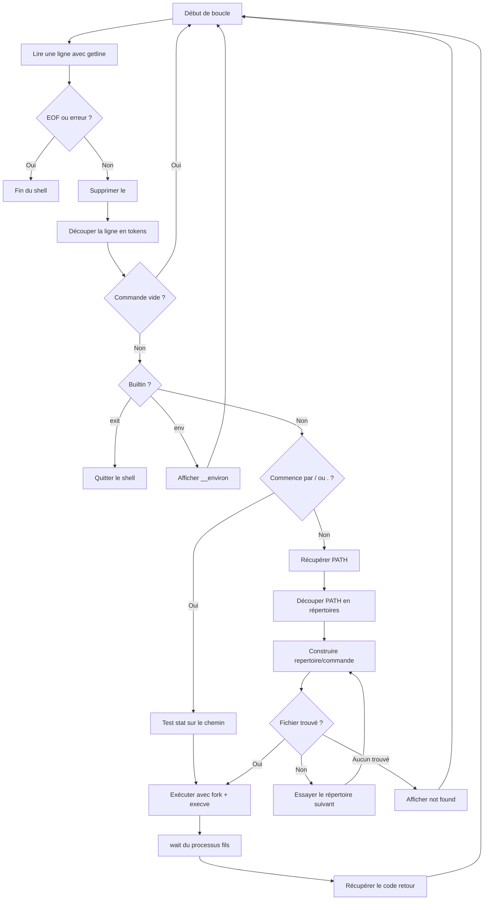

# Simple Shell

Un mini shell UNIX écrit en C dans le cadre du cursus Holberton.

---

## Sommaire

- [Présentation](#présentation)
- [Fonctionnalités implémentées](#fonctionnalités-implémentées)
- [Architecture du projet](#architecture-du-projet)
- [Compilation](#compilation)
- [Utilisation](#utilisation)
- [Fonctionnement détaillé](#fonctionnement-détaillé)
- [Builtins](#builtins)
- [Flowchart](#flowchart)
- [Limites connues](#limites-connues)
- [Exemple de session](#exemple-de-session)
- [Fichiers principaux](#fichiers-principaux)
- [Pistes d'amélioration](#pistes-damélioration)
- [Auteurs](#auteurs)

---

## Présentation

`simple_shell` est un interpréteur de commandes minimaliste.

Le programme :

- lit une ligne de commande avec `getline()` ;
- découpe la ligne en arguments avec `strtok()` ;
- détecte certains builtins ;
- tente une exécution directe si la commande commence par `/` ou `.` ;
- sinon recherche l'exécutable dans les répertoires de `PATH` ;
- crée un processus fils avec `fork()` ;
- lance la commande avec `execve()` ;
- attend la fin du processus avant de rendre la main.

En mode interactif, le prompt affiché est :

```bash
Bat2mort$
```

---

## Fonctionnalités implémentées

### Ce que le shell sait faire

- Détection du mode interactif avec `isatty()`
- Lecture de l'entrée standard avec `getline()`
- Suppression du caractère `\n` final
- Découpage de la commande en tokens à partir du séparateur espace simple
- Exécution d'un chemin direct comme `/bin/ls` ou `./programme`
- Recherche d'une commande dans `PATH`
- Exécution d'un programme via `fork()` + `execve()`
- Récupération du code retour du processus fils
- Affichage d'un message d'erreur de type `not found`
- Builtins `exit` et `env`

### Ce que le shell ne gère pas actuellement

- `cd`
- pipes (`|`)
- redirections (`>`, `>>`, `<`)
- opérateurs `;`, `&&`, `||`
- guillemets et échappements avancés
- variables shell et expansion complexe
- historique de commandes
- alias
- gestion complète des signaux

---

## Architecture du projet

Le shell suit une logique simple :

1. lecture de la ligne utilisateur ;
2. nettoyage de la ligne ;
3. tokenisation ;
4. détection d'un builtin ;
5. sinon tentative d'exécution directe ;
6. sinon recherche dans `PATH` ;
7. exécution dans un processus fils ;
8. récupération du statut et nouvelle itération.

---

## Compilation

Compilation classique avec GCC :

```bash
gcc -Wall -Wextra -Werror -pedantic *.c -o hsh
```

Lancement :

```bash
./hsh
```

---

## Utilisation

### Mode interactif

```bash
./hsh
```

Puis entrer des commandes comme :

```bash
ls
pwd
env
/bin/ls
./mon_programme
exit
```

### Mode non interactif

```bash
echo "ls" | ./hsh
```

---

## Fonctionnement détaillé

### 1. Lecture de la commande

La fonction `clean_getline()` :

- affiche `Bat2mort$ ` si l'entrée standard est un terminal ;
- lit la ligne avec `getline()` ;
- gère la fin de fichier ;
- retire le saut de ligne final ;
- transforme la chaîne en tableau d'arguments.

### 2. Tokenisation

La fonction `stroke_getline()` découpe la ligne avec :

```c
strtok(command_line, " ")
```

Le tableau d'arguments a une taille fixe de **64 entrées**.

### 3. Détection des builtins

Avant toute recherche dans `PATH`, le shell teste si la commande est un builtin :

- `exit`
- `env`

### 4. Exécution directe

Si la commande commence par `/` ou `.`, le shell considère qu'il s'agit d'un chemin et tente une exécution directe après vérification avec `stat()`.

### 5. Recherche dans `PATH`

Si la commande n'est ni un builtin ni un chemin direct :

- le shell récupère `PATH` depuis `env` ;
- découpe les répertoires avec `:` ;
- construit un chemin complet `repertoire/commande` ;
- teste l'existence avec `stat()` ;
- exécute le premier chemin valide trouvé.

### 6. Exécution du programme

L'exécution passe par :

- `fork()` pour créer un processus fils ;
- `execve()` dans le fils ;
- `wait()` dans le parent.

Le parent récupère ensuite le code retour réel du programme lancé.

### 7. Gestion des erreurs

Si aucune commande valide n'est trouvée, le shell affiche une erreur de la forme :

```bash
nom_du_shell: numéro_de_commande: commande: not found
```

---

## Builtins

### `env`

Affiche les variables d'environnement contenues dans `char **env`.

Exemple :

```bash
Bat2mort$ env
PATH=/usr/local/sbin:/usr/local/bin:/usr/sbin:/usr/bin:/sbin:/bin
HOME=/home/user
...
```

### `exit`

Quitte le shell.

Comportement observé dans le code :

- sans argument, `exit` renvoie le dernier code retour connu ;
- avec argument, le code lit les **un ou deux premiers chiffres** de l'argument pour produire le statut de sortie.

Exemples :

```bash
Bat2mort$ exit
Bat2mort$ exit 2
Bat2mort$ exit 42
```

---

## Flowchart



---

## Limites connues

Ces limites sont déduites du code actuel :

- Le parsing repose uniquement sur `strtok(..., " ")` : les tabulations, guillemets et cas complexes ne sont pas gérés.
- Le tableau d'arguments est limité à 64 cases.
- La fonction `execve()` est appelée avec `NULL` comme environnement transmis au programme exécuté.
- Le builtin `exit` ne convertit pas un entier général de manière robuste : l'implémentation ne traite correctement que des cas très simples, sur un ou deux caractères numériques.
- Le shell ne gère pas les commandes internes classiques comme `cd`.
- Le projet ne vise pas encore un comportement équivalent à `sh` ou `bash`.

---

## Exemple de session

```bash
$ ./hsh
Bat2mort$ pwd
/home/user/holbertonschool-simple_shell
Bat2mort$ ls
0-shell_tools.c  1-main_shell.c  4-fork_and_exec.c  7-build_in.c  shell.h
Bat2mort$ env
PATH=/usr/local/sbin:/usr/local/bin:/usr/sbin:/usr/bin:/sbin:/bin
HOME=/home/user
Bat2mort$ fakecommand
./hsh: 4: fakecommand: not found
Bat2mort$ exit 0
```

---

## Fichiers principaux

### `1-main_shell.c`
Boucle principale du shell, dispatch entre builtins, exécution directe et recherche dans `PATH`.

### `0-shell_tools.c`
Lecture utilisateur, suppression du `\n`, tokenisation et préparation du tableau de répertoires issu de `PATH`.

### `4-fork_and_exec.c`
Création du processus fils, exécution, attente et lancement via chemin direct ou via recherche dans `PATH`.

### `7-build_in.c`
Gestion des builtins `exit` et `env`.

### `3-general_tools.c`
Fonctions utilitaires de duplication, longueur de chaîne, comptage et libération mémoire.

### `5-general_tools_2.c`
Fonctions utilitaires supplémentaires : libération groupée, message d'erreur, comparaison de chaînes.

### `6-shell_tools_2.c`
Extraction de `PATH` depuis l'environnement.

### `2-debug_tools.c`
Fonction d'affichage de tableaux, utilisée notamment pour `env`.

### `shell.h`
Prototypes et inclusions nécessaires au projet.

---

## Pistes d'amélioration

- Implémenter `cd`
- Gérer les redirections et les pipes
- Ajouter un parsing plus robuste
- Passer l'environnement réel à `execve()`
- Gérer proprement les arguments de `exit`
- Ajouter la gestion des signaux
- Sécuriser davantage la gestion mémoire
- Améliorer la compatibilité avec les shells UNIX standards

---

## Auteurs

Voir le fichier `AUTHORS` du dépôt.

